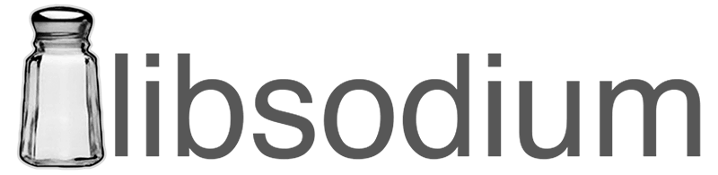
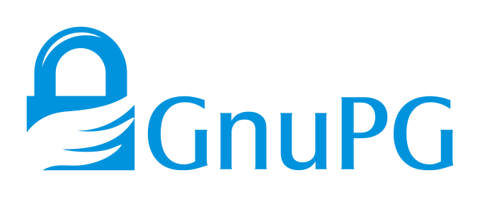
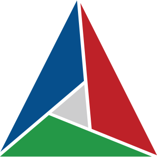
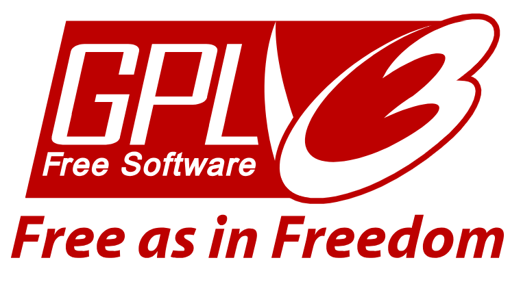

<!-- omit in toc -->
# Privacy Shield

```text
    ....      ..                     .       _                                            
  +^""888h. ~"888h                  @88>    u                                  ..         
 8X.  ?8888X  8888f     .u    .     %8P    88Nu.   u.                         @L          
'888x  8888X  8888~   .d88B :@8c     .    '88888.o888c       u           .   9888i   .dL  
'88888 8888X   "88x: ="8888f8888r  .@88u   ^8888  8888    us888u.   .udR88N  `Y888k:*888. 
 `8888 8888X  X88x.    4888>'88"  ''888E`   8888  8888 .@88 "8888" <888'888k   888E  888I 
   `*` 8888X '88888X   4888> '      888E    8888  8888 9888  9888  9888 'Y"    888E  888I 
  ~`...8888X  "88888   4888>        888E    8888  8888 9888  9888  9888        888E  888I 
   x8888888X.   `%8"  .d888L .+     888E   .8888b.888P 9888  9888  9888        888E  888I 
  '%"*8888888h.   "   ^"8888*"      888&    ^Y8888*""  9888  9888  ?8888u../  x888N><888' 
  ~    888888888!`       "Y"        R888"     `Y"      "888*""888"  "8888P'    "88"  888  
       X888^"""                      ""                 ^Y"   ^Y'     "P'            88F  
       `88f                                                                         98"   
        88                                                                        ./"     
        ""                                                                       ~`       
       ...                        .                     ..    ..       
   .x888888hx    :   .uef^"      @88>             x .d88"   dF         
  d88888888888hxx  :d88E         %8P               5888R   '88bu.      
 8" ... `"*8888%`  `888E          .         .u     '888R   '*88888bu   
!  "   ` .xnxx.     888E .z8k   .@88u    ud8888.    888R     ^"*8888N  
X X   .H8888888%:   888E~?888L ''888E` :888'8888.   888R    beWE "888L 
X 'hn8888888*"   >  888E  888E   888E  d888 '88%"   888R    888E  888E 
X: `*88888%`     !  888E  888E   888E  8888.+"      888R    888E  888E 
'8h.. ``     ..x8>  888E  888E   888E  8888L        888R    888E  888F 
 `88888888888888f   888E  888E   888&  '8888c. .+  .888B . .888N..888  
  '%8888888888*"   m888N= 888>   R888"  "88888%    ^*888%   `"888*""   
     ^"****""`      `Y"   888     ""      "YP'       "%        ""      
                         J88"                                          
                         @%                                            
                       :"                                              

Protect Your Privacy, Secure Your Digital World.                                         

```

\
[](https://github.com/dr8co/PrivacyShield/actions/workflows/cmake-multi-platform.yml)

<!-- omit in toc -->
## About

Privacy Shield is a suite of simple tools to help you manage your privacy.
These tools include:

* **[Password Manager](#password-manager)** – A simple password manager that encrypts your passwords for storage.
* **[File Encryptor/Decryptor](#file-encryptordecryptor)** – A simple tool to encrypt/decrypt your files.
* **[File Shredder](#file-shredder)** - A simple file shredder to securely delete your files.
* **[Browser Privacy Tracks Cleaner](#browser-privacy-tracks-cleaner)** – Cleans browser cookies and history items.
* **[File Deduplicator](#file-deduplicator)** – A bonus tool to help remove redundant files.

<!-- omit in toc -->
## Table of Contents

<!-- TOC -->
* [Motivation](#motivation)
* [Features](#features)
* [The Tools in Detail](#the-tools-in-detail)
  * [Password Manager](#password-manager)
  * [File Encryptor/Decryptor](#file-encryptordecryptor)
  * [File Shredder](#file-shredder)
  * [Browser Privacy Tracks Cleaner](#browser-privacy-tracks-cleaner)
  * [Duplicate File detector](#file-deduplicator)
* [Building and Installation](#building-and-installation)
  * [Prerequisites](#prerequisites)
  * [Building from Source](#building-from-source)
  * [Installation](#installation)
    * [Pre-built Packages](#pre-built-packages)
    * [Manual Installation](#manual-installation)
  * [Uninstallation](#uninstallation)
    * [Package Managers](#package-managers)
    * [Manual](#manual)
* [Usage](#usage)
  * [Command Line Interface](#command-line-interface)
* [Contributing](#contributing)
* [Authors](#authors)
* [Acknowledgement](#acknowledgement)
* [Disclaimer](#disclaimer)
* [Technologies used](#powered-by)
* [License](#license)
<!-- TOC -->

## Motivation

Every endeavor is driven by inspiration, and Privacy Shield is no exception.
It was born from a relentless pursuit to protect our digital lives
and inspired by the stories of privacy advocates and individuals who fell victim to privacy breaches.

I sought to create a simple, yet formidable defense against the ever-expanding data-driven landscape,
empowering individuals like you to reclaim your privacy and fortify your digital existence.
Thus, the Privacy Shield was born—a culmination of my passion for technology and my unwavering commitment
to safeguarding privacy.

## Features

* **Cross-Platform** – Privacy Shield is written in C++ and uses CMake as its build system,
so it can be built on any Unix platform that supports C++23 and the dependencies.

* **Secure** – Privacy Shield uses secure cryptographic algorithms and protocols to handle sensitive data.
Security is a complex topic, and the current implementation of Privacy Shield is not perfect.
If you find any security vulnerabilities, please report them, or better yet, submit a pull request.

* **Easy to Use** – Privacy Shield is designed to be easy to use, with a simple command-line interface.

* **Fast** – Privacy Shield is designed to be fast, with support for multi-threading and concurrency.

* **Lightweight** and **Portable** – The design is straightforward and lightweight.

* **Safe** – Privacy Shield supports safe operations, with support for cancellation and error handling.

* **Free** – Privacy Shield is free and open-source software, licensed under the GNU General Public License v3.0.
See [LICENSE](./LICENSE) for more information.

* **No Ads**, **Tracking**, and **Telemetry** – Privacy Shield is free of all these things.

* **No Backdoors**, **Spyware**, and **Malware** – You can verify this yourself by inspecting the source code.

## The Tools in Detail

Privacy Shield now runs exclusively in the command line in an interactive mode.

All the commands/operations are presented in a menu-like interface,
and are not saved in the shell command history.

Any operation with any tool can be canceled at any time by pressing `Ctrl+C`,
and confirming the cancellation.

**Note:**\
The program uses ANSI escape codes for colors and formatting. If you experience issues with the colors,
you can disable them by setting the `NO_COLOR` environment variable to `true` (or `1`),
or by using the `--no-color` or `-nc` option.

```bash
export NO_COLOR=true && privacyShield
```

or

```bash
privacyShield --no-color
```

The program will automatically detect the `NO_COLOR` environment variable, and the terminal capabilities
to determine if colors should be used.

### Password Manager

The password manager requires a primary password to encrypt/decrypt your passwords.
The primary password is verified using the [Argon2id algorithm](https://en.wikipedia.org/wiki/Argon2),
which is a memory-hard password hashing algorithm,
designed to resist side-channel attacks and slow down brute-force attacks.

The primary password **must be strong** and **must not be forgotten.**
**Forgetting the primary password will result in the loss of all passwords stored in the password manager.**

**Note:** When typing a password, the characters are not displayed on the screen for security reasons,
and you will be asked to confirm it by typing it again.

A password record consists of the following fields:

* **Name** – The name of the password record (can be a site name, an application name, etc.)
* **Username** – The username of the password record (optional)
* **Password** – The password of the password record.

The passwords are encrypted (and Base64-encoded) before being stored in a file.
The actual encryption is done in two steps:

1. The 'password' field of a record (the actual password) is encrypted using the `256-bit Serpent cipher in counter mode (CTR)`.
2. All the fields (including the encrypted password) are encrypted using the `256-bit AES cipher in cipher block chaining mode (CBC)`.

The keys (256-bit) for the two steps are derived from the primary password using the
[PBKDF2 algorithm](https://en.wikipedia.org/wiki/PBKDF2), ([salted](https://en.wikipedia.org/wiki/Salt_(cryptography))
with random bytes).

No two password records are encrypted using the same key.
To be precise, each field of a password record is encrypted independently using a different key.
Also, no two records share the same key, i.e., if you have 100 passwords, then 400 unique keys will
be derived from the primary password for encryption/decryption of the passwords.
**This is done to slow down [brute-force attacks](https://en.wikipedia.org/wiki/Brute-force_attack).**\
Empty entries/fields are encrypted as well.

The process might be slow, and multithreading has been leveraged to speed up the process.

The [Serpent cipher](https://en.wikipedia.org/wiki/Serpent_(cipher))
is used for the first step because it is a
conservative and secure cipher with more rounds than [AES cipher](https://en.wikipedia.org/wiki/Advanced_Encryption_Standard)
(32 rounds vs 14 rounds, hence a larger security margin) that is resistant to cryptanalysis.
The [counter mode (CTR)](https://en.wikipedia.org/wiki/Block_cipher_mode_of_operation#Counter_(CTR))
is used for it because it is a fast and secure mode that is resistant to padding oracle attacks.
A non-deterministic random [nonce](https://en.wikipedia.org/wiki/Cryptographic_nonce)
is used in the CTR mode to prevent nonce reuse (or misuse?).

The [AES cipher](https://en.wikipedia.org/wiki/Advanced_Encryption_Standard)
is used for the second step because it is a
reputably strong and secure block cipher that has been widely used and tested.
The [cipher block chaining mode (CBC)](https://en.wikipedia.org/wiki/Block_cipher_mode_of_operation#Cipher_Block_Chaining_(CBC))
ensures that the ciphertext of a block depends on all plaintext blocks processed up to that point, so that
the ciphertext does not reveal patterns in the plaintext.
Similar to the CTR mode, a non-deterministic random [initialization vector (IV)](https://en.wikipedia.org/wiki/Initialization_vector)
is used in the CBC mode to prevent IV reuse.

For these reasons, the password manager is considerably
slower at startup and when saving changes to the password file.
Multithreading is used to speed up the encryption/decryption process to some extent.

During runtime, the password manager stores the passwords in memory.
The memory is locked to prevent the passwords from being swapped to disk,
and is cleared (zeroized, i.e., filled with zeros) when the password manager exits,
even if a fatal error occurs, or if the program exits unexpectedly.

The password manager also features the following tools:

* **Password Generator** – A simple password generator to generate strong passwords.
* **Password Strength Checker** – A simple password strength checker to check the strength of your passwords.
* **Password Exporter** – Exports your passwords to a CSV file.
* **Password Importer** – Imports passwords from a CSV file.
* **Analytics** – A simple analytics tool to analyze your passwords for strength and reuse.

**A note on importation**\
For importing passwords, the CSV file **must have three and only three columns**: _name_, _username_, and _password_ (in that order).
The file can have a header row, but it is not required (the program will ask you if the file has a header row).
**Non-conforming rows will be skipped**.

The imported passwords will be deduplicated and merged with the existing passwords.
If a password already exists, the program will ask you if you want to overwrite it.

### File Encryptor/Decryptor

The file encryptor/decryptor requires a password to encrypt/decrypt your files.
The password is not stored anywhere (neither verified during decryption) and is only used to encrypt/decrypt the files.

**Forgetting the password will result in the loss of all encrypted data.**

If a wrong password is provided, decrypted data will be garbage, or the decryption will fail altogether.

The following block ciphers are supported (all with 256-bit keys):

* **[AES](https://en.wikipedia.org/wiki/Advanced_Encryption_Standard)**
in **[CBC mode](https://en.wikipedia.org/wiki/Block_cipher_mode_of_operation#Cipher_Block_Chaining_(CBC))**
* **[Serpent](https://en.wikipedia.org/wiki/Serpent_(cipher))**
in **[CTR mode](https://en.wikipedia.org/wiki/Block_cipher_mode_of_operation#Counter_(CTR))**
* **[Twofish](https://en.wikipedia.org/wiki/Twofish)**
in **CTR** mode
* **[Camellia](https://en.wikipedia.org/wiki/Camellia_(cipher))**
in **CBC** mode
* **[ARIA](https://en.wikipedia.org/wiki/ARIA_(cipher))**
in **CBC** mode

These block ciphers are all strong and secure ciphers that have been widely used and tested.

Serpent and Twofish feature more rounds than their counterparts, and are therefore slower (but more secure?).

**The default algorithm is AES-256 in CBC mode.**

The 256-bit encryption/decryption keys are derived from the password using the [PBKDF2 algorithm](https://en.wikipedia.org/wiki/PBKDF2)
[salted](https://en.wikipedia.org/wiki/Salt_(cryptography))
with random bytes.

For the CBC mode, a non-deterministic random
[initialization vector (IV)](https://en.wikipedia.org/wiki/Initialization_vector)
is used,
and for the CTR mode, a non-deterministic random
[nonce](https://en.wikipedia.org/wiki/Cryptographic_nonce) is used.
This is done to prevent IV/nonce reuse.

By default, the encrypted files are saved with a `.enc` extension.

The files encrypted by this program can only be decrypted by this program,
and the files encrypted by other programs cannot be decrypted by this program.
This is because this program uses a specific format for the encrypted files,
and the other programs may use a different format.

Future versions of the program may support authenticated modes of encryption.

### File Shredder

The file shredder securely deletes your files by overwriting them with random bytes.

The user can specify the number of overwrites.
The default is 3 overwrites.

The file shredder supports the following overwriting methods:

* **Random Bytes** – Overwrites the file with random bytes.
* **3-Pass DOD 5220.22-M** – Overwrites the file with a byte, then with the complement of the byte, and finally with random bytes.
* **7-Pass DOD 5220.22-M** – 3-Pass DOD 5220.22-M twice, with a random overwrite in between.

More about the DOD 5220.22-M standard can be found
[here](https://en.wikipedia.org/wiki/Data_erasure#Standards).

The default overwriting method is a 3-pass overwrite with random bytes.

The random bytes are generated using the
[Mersenne Twister](https://en.wikipedia.org/wiki/Mersenne_Twister)
algorithm,
seeded with random bytes from the `OS entropy pool`(dictated by C++'s
[std::random_device](https://en.cppreference.com/w/cpp/numeric/random/random_device)
implementation on the platform).

The cluster tips of the file are also overwritten with zeros by default, and this can be disabled by the user.

After shredding, the file is renamed to a random name thrice, and then deleted (removed, not sent to the recycle bin).

The last write time of the file is also restored to the original value before removal.

### Browser Privacy Tracks Cleaner

The browser privacy tracks cleaner cleans browser cookies and history items.

Currently, **only Linux and macOS are supported**.

It supports the **default installations** of the following browsers:

* **Google Chrome**
* **Mozilla Firefox**
* **Apple Safari**
* **Opera**
* **Chromium**

It scans for supported browsers in the default installation directories,
and then scans for cookies and history databases in the available profile directories.

### File Deduplicator

This tool detects duplicate files in a directory and its subdirectories.

Currently, it only offers detection of duplicate files, and not deletion of the duplicate files.
This is because the deletion of duplicate files is a potentially dangerous operation,
and the user should be careful when deleting files.

However, the deletion of duplicate files may be implemented in the future.

It uses [BLAKE3](https://github.com/BLAKE3-team/BLAKE3) hash function
to compute the hashes of the files and detect duplicates.

BLAKE3 is a fast and secure hash function that is resistant to extension attacks.

The hashes are computed in parallel using multiple threads to speed up the process.

## Building and Installation

### Prerequisites

* A [Unix-like](https://en.wikipedia.org/wiki/List_of_Unix_systems#Unix-like_operating_systems)
operating system, such as [Linux](https://en.wikipedia.org/wiki/Linux),
[BSD](https://en.wikipedia.org/wiki/Berkeley_Software_Distribution), or [macOS](https://en.wikipedia.org/wiki/MacOS).
* A C++ compiler with [C++23](https://en.cppreference.com/w/cpp/23) support,
and [C++20 Modules](https://en.cppreference.com/w/cpp/language/modules) support.
For this project, [GCC 14](https://gcc.gnu.org/gcc-14/) (or newer),
or [LLVM Clang 18](https://clang.llvm.org/) (or newer) is required.
* [CMake](https://cmake.org/) 3.28+
* [Ninja](https://ninja-build.org/) 1.11+, or any other build system compatible with CMake and **C++20 Modules**.
* [OpenSSL](https://www.openssl.org/) 3+
* [Sodium](https://libsodium.org/) 1.0.18+
* [GCrypt](https://gnupg.org/software/libgcrypt/index.html) 1.10+
* [BLAKE3](https://github.com/BLAKE3-team/BLAKE3) 1.4+ (Fetched automatically by CMake, if not already installed)
* [Isocline](https://github.com/daanx/isocline) (Fetched automatically by CMake)

**Note:**\
This project utilizes the [C++20 Modules](https://en.cppreference.com/w/cpp/language/modules) feature,
which is not yet fully supported by all C++ compilers.

The selected C++ compiler must support C++20 Modules, and must provide a way to discover
the import graph dependencies.

Only [LLVM Clang](https://clang.llvm.org/) 17+ (16 has an issue in CMake,
where CMake extensions have to be turned off to use modules)
support this feature via the `clang-scan-deps` tool
at the time of writing.

GCC 14 is expected to support this feature as well.

Also, a generator that supports C++20 Modules is required.
[Ninja](https://ninja-build.org/) 1.11+ is recommended.

#### IMPORTANT: A note on installing/building BLAKE3

BLAKE3 is not available in the package repositories of most Linux distributions,
so you will need to build it from the source and install it manually.

You can run [install-blake3.sh](./scripts/install-blake3.sh) script to install BLAKE3 automatically,
Or you can follow the steps at [BLAKE3's GitHub page](https://github.com/BLAKE3-team/BLAKE3/blob/master/c/README.md#building)

Another option is to install BLAKE3 using a package manager, such as [Vcpkg](https://vcpkg.io): `vcpkg install blake3`.

**Installing with the script is recommended, as it will also set up the required CMake module for BLAKE3 automatically.**

### Building from Source

After installing the prerequisites, you can install Privacy Shield by following the steps below:

```bash
# Clone the repository (or download the source code)
git clone https://github.com/dr8co/PrivacyShield.git

# Build from the main branch
git checkout main

# Change directory to the project root
cd PrivacyShield

# Configure the project
cmake -S . -B build -DCMAKE_BUILD_TYPE=Release -DCMAKE_CXX_COMPILER=clang++-18 -G Ninja

# Build the project
cmake --build build --config Release -j 4

# Install the program (optional)
cmake --install build # Might need sudo
```

Remember to replace `clang++-18` with your C++ compiler, and `4` with the number of CPU cores you have (for faster builds).\
Also, replace `Ninja` with your build system if you are not using Ninja.

You can then run the program from the build directory:

```bash
# Assuming you are in the project root
./build/privacyShield
```

### Installation

#### Pre-built Packages

You can download a package for your platform from the
[releases page](https://github.com/dr8co/PrivacyShield/releases).

The package will contain the built executable, and you can install it using the package manager of your platform.

For the macOS package, you can simply drag the .dmg file to your Applications folder.

The current macOS package was built on macOS 14.5 arm64 (M1 chip),
and might not work on older versions of macOS.

For the Linux package, you can install the .deb or .rpm file using the package manager of your distribution.\
Internet connection might be required to install the dependencies.

For instance, on Ubuntu, you can install the .deb file using the following command:

```bash
sudo dpkg -i privacyshield_2.5.0_amd64.deb # Replace with the actual file path
# You can also use apt to install it:
sudo apt install ./privacyshield_2.5.0_amd64.deb # Replace with the actual file path
```

On RPM-based distributions like Fedora, you can install the .rpm file using the following command:

```bash
sudo rpm -i privacyshield-2.5.0-1.x86_64.rpm # Replace with the actual file path
```

The packages can be verified using the [GnuPG](https://gnupg.org/) signature files provided.

#### Manual Installation

After building from the source, you can install the built executable to a custom location by adding
`-DCMAKE_INSTALL_PREFIX=/path/to/install` option to the configuration step when building from the source.

The program can then be run by typing `privacyShield` in your terminal
(if you've installed to a custom location, you might need to add that installation location to your `PATH`
environment variable)

### Uninstallation

#### Package Managers

The package manager used to install the package can be used to uninstall it.

The specific commands to uninstall the package will depend on the package manager and the platform.

#### Manual

If you have installed Privacy Shield manually, you can uninstall it by running the following command:

```bash
# From the project root, run:
xargs rm -f < build/install_manifest.txt # Might need sudo
```

Or, just remove everything listed in the `build/install_manifest.txt` file.

## Usage

### Command Line Interface

Privacy Shield comes with a command line interface (CLI) that allows you to use the program from your terminal.

The CLI is interactive, which means that you can use it by choosing options from a menu.
There is no need to remember commands or arguments, as the CLI will guide you through the process.

To use the CLI, simply run the program by typing `privacyShield` in your terminal.

**Tab completion is supported** for most input fields.

## Contributing

Contributions are welcome! Please read [CONTRIBUTING.md](./CONTRIBUTING.md) for details on our code of conduct,
and the process for submitting pull requests.

## Authors

* **[Ian Duncan](https//github.com/dr8co)** – *Initial work*

## Acknowledgement

Thanks to [Henrik Steffen Gaßmann](mailto:henrik@gassmann.onl) for [the CMake module](./CMakeModules/FindSodium.cmake)
to configure the local libsodium installation.

## Disclaimer

Privacy Shield Suite does not guarantee the development of superhuman powers or sudden urges
to wear capes while browsing the internet.

However, the feeling of empowered privacy protection is a strong possibility!

## Powered By

[](https://www.openssl.org/)


[](https://libsodium.org/)


[](https://gnupg.org/)


[](https://github.com/BLAKE3-team/BLAKE3)


[](https://cmake.org/)


[](https://github.com/daanx/isocline)

## License

[](https://www.gnu.org/licenses/gpl-3.0.en.html)

This project is licensed under the GNU GPLv3 License—see the [LICENSE](./LICENSE) file for details.

All third party libraries are licensed under their respective licenses.
