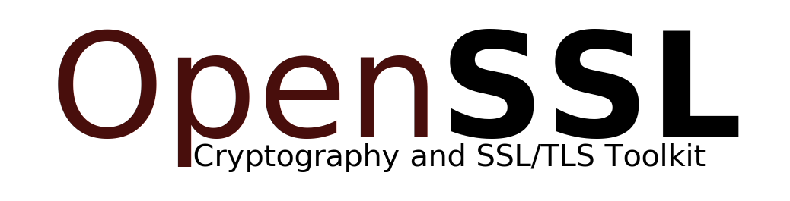
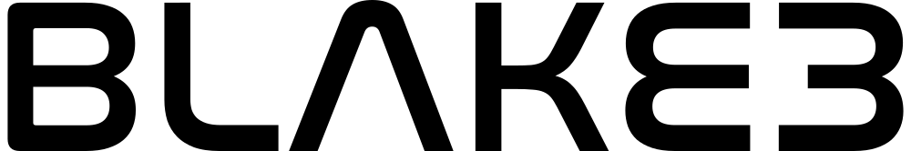

# Privacy Shield

```text
    ....      ..                     .       _                                            
  +^""888h. ~"888h                  @88>    u                                  ..         
 8X.  ?8888X  8888f     .u    .     %8P    88Nu.   u.                         @L          
'888x  8888X  8888~   .d88B :@8c     .    '88888.o888c       u           .   9888i   .dL  
'88888 8888X   "88x: ="8888f8888r  .@88u   ^8888  8888    us888u.   .udR88N  `Y888k:*888. 
 `8888 8888X  X88x.    4888>'88"  ''888E`   8888  8888 .@88 "8888" <888'888k   888E  888I 
   `*` 8888X '88888X   4888> '      888E    8888  8888 9888  9888  9888 'Y"    888E  888I 
  ~`...8888X  "88888   4888>        888E    8888  8888 9888  9888  9888        888E  888I 
   x8888888X.   `%8"  .d888L .+     888E   .8888b.888P 9888  9888  9888        888E  888I 
  '%"*8888888h.   "   ^"8888*"      888&    ^Y8888*""  9888  9888  ?8888u../  x888N><888' 
  ~    888888888!`       "Y"        R888"     `Y"      "888*""888"  "8888P'    "88"  888  
       X888^"""                      ""                 ^Y"   ^Y'     "P'            88F  
       `88f                                                                         98"   
        88                                                                        ./"     
        ""                                                                       ~`       
       ...                        .                     ..    ..       
   .x888888hx    :   .uef^"      @88>             x .d88"   dF         
  d88888888888hxx  :d88E         %8P               5888R   '88bu.      
 8" ... `"*8888%`  `888E          .         .u     '888R   '*88888bu   
!  "   ` .xnxx.     888E .z8k   .@88u    ud8888.    888R     ^"*8888N  
X X   .H8888888%:   888E~?888L ''888E` :888'8888.   888R    beWE "888L 
X 'hn8888888*"   >  888E  888E   888E  d888 '88%"   888R    888E  888E 
X: `*88888%`     !  888E  888E   888E  8888.+"      888R    888E  888E 
'8h.. ``     ..x8>  888E  888E   888E  8888L        888R    888E  888F 
 `88888888888888f   888E  888E   888&  '8888c. .+  .888B . .888N..888  
  '%8888888888*"   m888N= 888>   R888"  "88888%    ^*888%   `"888*""   
     ^"****""`      `Y"   888     ""      "YP'       "%        ""      
                         J88"                                          
                         @%                                            
                       :"                                              

Protect Your Privacy, Secure Your Digital World.                                         

```

## About

Privacy Shield is a suite of simple tools to help you manage your privacy in the digital world.

The tools included in Privacy Shield are:

* **Password Manager** - A simple password manager that stores your passwords in an encrypted file.
* **File Encryptor/Decryptor** - A simple tool to encrypt/decrypt your files.
* **File Shredder** - A simple file shredder to securely delete your files.
* **Browser Privacy Tracks Cleaner** - A simple tool to clean browser cookies and history items.
* **File Deduplicator** - A bonus tool to help remove redundant files.

## The Tools in Detail

### Password Manager

The password manager requires a primary password to encrypt/decrypt your passwords.
It is verified using the `Argon2id` algorithm,
which is a memory-hard password hashing algorithm,
designed to resist side-channel attacks and slow down brute-force attacks.

The primary password **must be a strong** and **must not be forgotten.**
**Forgetting the primary password will result in the loss of all passwords stored in the password manager.**

The passwords are encrypted (and Base64-encoded) before being stored in a file.
The actual encryption is done in two steps:

1. Encrypt the 'password' field of a record (the actual password) using the `256-bit Serpent cipher in counter mode (CTR)`.
2. Encrypt all the fields (including the encrypted password) using the `256-bit AES cipher in cipher block chaining mode (CBC)`.

The keys (256-bit) for the two steps are derived from the primary password using the `PBKDF2` algorithm (salted with a random salt).

No two password records are encrypted using the same key.
To be precise, each field of a password record is encrypted independently using a different key.
**This is done to slow down brute-force attacks.**

The Serpent cipher is used for the first step because it is a
strong and secure cipher with more rounds than AES (32 rounds vs 14 rounds) that is resistant to cryptanalysis.
The CTR mode is used for it because it is a fast and secure mode that is resistant to padding oracle attacks.
A non-deterministic random nonce is used in the CTR mode to prevent nonce reuse (or misuse?).

The AES cipher is used for the second step because it is a
reputably strong and secure block cipher that has been widely used and tested.
The CBC mode ensures that the ciphertext of a block depends on all plaintext blocks processed up to that point, so that
the ciphertext does not reveal patterns in the plaintext.
Similar to the CTR mode, a non-deterministic random initialization vector (IV)
is used in the CBC mode to prevent IV reuse.

For these reasons, the password manager is considerably
slower at startup and when saving changes to the password file.
Multithreading is used to speed up the encryption/decryption process to some extent.

The password manager also supports the following features:

* **Password Generator** - A simple password generator to generate strong passwords.
* **Password Strength Checker** - A simple password strength checker to check the strength of your passwords.
* **Password Exporter** - A simple password exporter to export your passwords to a CSV file.
* **Password Importer** - A simple password importer to import your passwords from a CSV file.
* **Analytics** - A simple analytics tool to analyze your passwords for strength and reuse.

### File Encryptor/Decryptor

The file encryptor/decryptor requires a password to encrypt/decrypt your files.
The password is not stored anywhere (neither verified) and is only used to encrypt/decrypt the files.

**Forgetting the password will result in the loss of all encrypted data.**

If a wrong password is provided, decrypted data will be garbage, or the decryption will fail altogether.

The following encryption/decryption algorithms are supported:

* **AES-256** in **CBC** mode
* **Serpent-256** in **CTR** mode
* **Twofish-256** in **CTR** mode
* **Camellia-256** in **CBC** mode
* **ARIA-256** in **CBC** mode

These block ciphers are all strong and secure ciphers that have been widely used and tested.

Serpent and Twofish feature more rounds than their counterparts, and are therefore slower (but more secure?).

The default algorithm is **AES-256** in **CBC** mode.

The 256-bit encryption/decryption keys are derived from the password using the `PBKDF2` algorithm, salted with random bytes.

For the CBC mode, a non-deterministic random initialization vector (IV) is used,
and for the CTR mode, a non-deterministic random nonce is used.
This is done to prevent IV/nonce reuse.

### File Shredder

The file shredder securely deletes your files by overwriting them with random bytes.

The number of overwrites can be specified by the user.
The default is 3 overwrites.

The file shredder supports the following overwriting methods:

* **Random Bytes** - Overwrites the file with random bytes.
* **3-Pass DOD 5220.22-M** - Overwrites the file with a random byte, then with the complement of the random byte, and finally with random bytes.
* **7-Pass DOD 5220.22-M** - 3-Pass DOD 5220.22-M twice, with a random overwrite in between.

The default overwriting method is a 3-pass overwrite with random bytes.

The random bytes are generated using the `Mersenne Twister` algorithm,
seeded with random bytes from the `OS entropy pool`
(governed by C++'s `std::random_device` implementation on the platform).

The cluster tips of the file are also overwritten with zeros by default, and this can be disabled by the user.

After shredding, the file is renamed to a random name thrice, and then deleted (removed, not sent to the recycle bin).

### Browser Privacy Tracks Cleaner

The browser privacy tracks cleaner cleans browser cookies and history items.

Currently, **only Linux and macOS are supported**.

It supports the **default installations** of the following browsers:

* **Google Chrome**
* **Mozilla Firefox**
* **Apple Safari**
* **Opera**
* **Chromium**

It scans for supported browsers in the default installation directories,
and then scans for cookies and history databases in the available profile directories.

### File Deduplicator

This tool detects duplicate files in a directory and its subdirectories.

Currently, it only offers detection of duplicate files, and not deletion of the duplicate files.
This is because the deletion of duplicate files is a potentially dangerous operation,
and the user should be careful when deleting files.

However, the deletion of duplicate files may be implemented in the future.

It uses [BLAKE3](https://github.com/BLAKE3-team/BLAKE3) hash function
to compute the hashes of the files and detect duplicates.

BLAKE3 is a fast and secure hash function that is resistant to extension attacks.

The hashes are computed in parallel using multiple threads to speed up the process.

## Motivation

Every endeavor is driven by inspiration, and Privacy Shield is no exception.
It was born from a relentless pursuit to protect our digital lives
and inspired by the stories of privacy advocates and individuals who fell victim to privacy breaches.

I sought to create a simple, yet formidable defense against the ever-expanding data-driven landscape,
empowering individuals like you to reclaim your privacy and fortify your digital existence.
Thus, the Privacy Shield was born—a culmination of my passion for technology and my unwavering commitment
to safeguarding privacy.

Are you ready to don your digital armor and become a guardian of your own privacy?
Privacy Shield invites you to join the ranks of those who refuse to compromise on privacy.
Take control of your digital destiny,
revel in the peace of mind that fortified privacy brings, and protect what matters most—your personal information.

Together, let's shape a world where privacy reigns supreme,
and our digital sanctuaries remain impervious to prying eyes.

## Attributes

* **Cross-Platform** - Privacy Shield is written in C++ and uses CMake as its build system,
so it can be built on any Unix platform that supports C++23 and CMake.

* **Easy to Use** - Privacy Shield is designed to be easy to use, with a simple command-line interface.

* **Fast** - Privacy Shield is designed to be fast, with support for multi-threading and concurrency.

* **Lightweight** and **Portable** - The design is simple and lightweight.

* **Free** - Privacy Shield is free and open-source software, licensed under the GNU General Public License v3.0.
See [LICENSE](./LICENSE) for more information.

* **No Ads**, **Tracking**, and **Telemetry** - Privacy Shield is free of all these things.

* **No Backdoors**, **Spyware**, and **Malware** - You can verify this yourself by inspecting the source code.

## Getting Started

### Prerequisites

* A [Unix-like](https://en.wikipedia.org/wiki/List_of_Unix_systems#Unix-like_operating_systems)
operating system, such as [Linux](https://en.wikipedia.org/wiki/Linux),
[BSD](https://en.wikipedia.org/wiki/Berkeley_Software_Distribution), or [macOS](https://en.wikipedia.org/wiki/MacOS).
* A C++ compiler with C++23 support. For this project, [GNU GCC 13](https://gcc.gnu.org/gcc-13/) (or later),
or [LLVM Clang 17](https://clang.llvm.org/) (or later) is required.
* [CMake](https://cmake.org/) 3.25+
* [Ninja](https://ninja-build.org/) 1.10+
* [OpenSSL](https://www.openssl.org/) 3+
* [Sodium](https://libsodium.org/) 1.0.18+
* [GCrypt](https://gnupg.org/software/libgcrypt/index.html) 1.10+
* [BLAKE3](https://github.com/BLAKE3-team/BLAKE3)
* [GNU Readline](https://tiswww.case.edu/php/chet/readline/rltop.html) 8+

### Installation/Building

After installing the prerequisites, you can install Privacy Shield by following the steps below:

```bash
# Clone the repository (or download the source code)
git clone https://github.com/dr8co/PrivacyShield.git

# Change directory to the project root
cd PrivacyShield

# Configure the project
cmake -S . -B build -DCMAKE_BUILD_TYPE=Release -DCMAKE_CXX_COMPILER=g++-13 -G Ninja

# Build the project
cmake --build build --config Release -j 4

# Install the program (optional)
cmake --install build --config Release # Might need sudo
```

Remember to replace `g++-13` with your C++ compiler, and `4` with the number of CPU cores you have (for faster builds).

You can also install to a custom location by adding `-DCMAKE_INSTALL_PREFIX=/path/to/install` to the configure step.

If you've installed Privacy Shield, you can run the program by typing `privacyShield` in your terminal
(if you've installed to a custom location, you will need to add that install location to your `PATH` environment variable)

If not, you can run the compiled target directly:

```bash
# Assuming you are in the project root
./build/src/privacyShield
```

### Uninstallation

If you have installed Privacy Shield, you can uninstall it by running the following command:

```bash
# From the project root, run:
xargs rm < build/install_manifest.txt # Might need sudo
```

## Usage

### Command Line Interface

Privacy Shield comes with a command line interface (CLI) that allows you to use the program from your terminal.

The CLI is interactive, which means that you can use it by choosing options from a menu.
There is no need to remember commands or arguments, as the CLI will guide you through the process.

To use the CLI, simply run the program by typing `privacyShield` in your terminal.

## Contributing

Contributions are welcome! Please read [CONTRIBUTING.md](./CONTRIBUTING.md) for details on our code of conduct,
and the process for submitting pull requests.

## Authors

* **[Ian Duncan](https//github.com/dr8co)** - *Initial work*

## Disclaimer

Privacy Shield Suite does not guarantee the development of superhuman powers or sudden urges
to wear capes while browsing the internet.

However, the feeling of empowered privacy protection is a strong possibility!

## Powered By

[](https://www.openssl.org/)


[](https://libsodium.org/)


[](https://gnupg.org/)


[](https://github.com/BLAKE3-team/BLAKE3)


[](https://tiswww.case.edu/php/chet/readline/rltop.html)


[](https://cmake.org/)

## License

[](https://www.gnu.org/licenses/gpl-3.0.en.html)

This project is licensed under the GNU GPLv3 License—see the [LICENSE](./LICENSE) file for details.

All third party libraries are licensed under their respective licenses.
